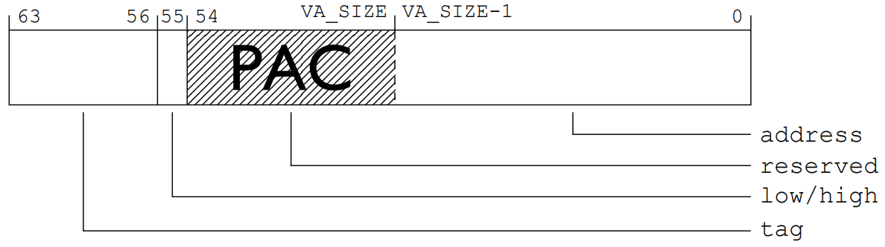
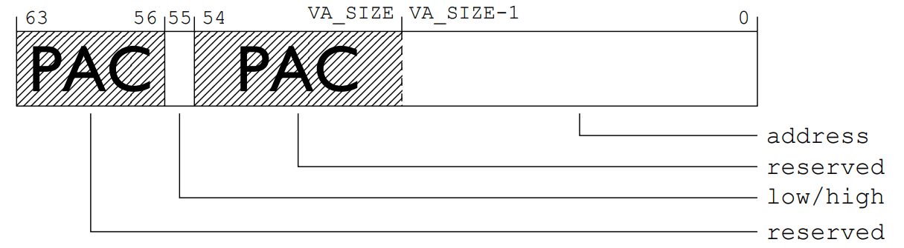
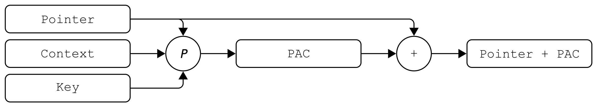
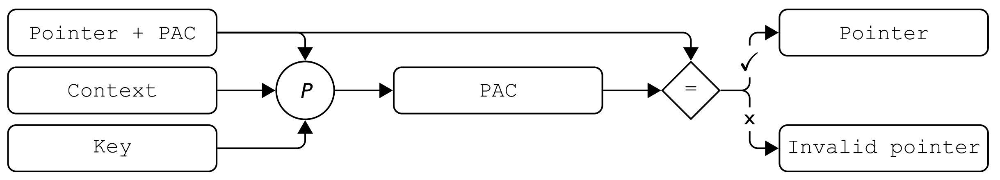

# PAC

## 概述

Pointer Authentication Code（PAC，指针认证代码）用来防止对内存破坏攻击的利用。其核心思想是**利用指针的高位比特存储指针认证码**，PAC是对指针值及额外上下文信息的加密签名。

ARMv8.3-A架构第一次引入了该机制。该架构新增了专用指令，用于向指针添加认证码，以及验证带PAC的指针、恢复原始指针值。这一机制使系统能够通过密码学手段确保特定指针未被攻击者篡改，从而极大提升应用安全性。

指针认证的可行性基于一个关键观察：虽然指针为64位，但多数系统的虚拟地址空间远小于此，导致指针中存在未使用的比特位。指针认证利用这些比特位存储基于原始64位指针值和64位上下文值的短认证码。

## 密钥

系统可采用自定义算法计算PAC，但ARM标准推荐使用名为**QARMA**的轻量级分组密码。根据白皮书，QARMA是"专为指针认证设计的新型可调分组密码家族"。<font color="red">标准中使用的QARMA-64变体以128位密钥、64位明文（指针）和64位调整值（上下文）为输入，生成64位密文。**截断后的密文作为PAC嵌入指针未使用的扩展比特位**</font>。

密钥有五种：
* 指令指针：APIAKey、APIBKey
* 数据指针：APDAKey、APDBKey
* 通用：APGAKey

对于Apple的系统来说，项目按照如下所示加盐和签名[<sup>7</sup>](#refer-anchor-7)。

|项目|密钥|上下文|
|-|-|-|
|函数返回地址|IB|存储地址|
|函数指针|IA|0|
|块调用函数|IA|存储地址|
|Objective-C 方法缓存|IB|存储地址 + 类 + 选择器|
|C++ 虚函数表条目|IA|存储地址 + 哈希值（方法修饰名）|
|计算的 Goto 标签|IA|哈希值（函数名称）|
|内核线程状态|GA|·|
|用户线程状态寄存器|IA|存储地址|
|C++ 虚函数表指针|DA|0|

有tag时，PAC被嵌入到指针的保留位（[48, 54]，共7位）。



无tag时，PAC被嵌入到指针的保留位（[48, 54] U [56, 63]，共15位）。



## 操作

### 签名

PAC\*指令：生成PAC并插入指针扩展位。
* 示例：`PACIA X8, X9`使用A指令密钥APIAKey和X9中的上下文值计算X8指针的PAC，结果写回X8。
* 变体如`PACIZA`，将上下文固定为0。



### 认证

AUT\*指令：验证指针PAC及上下文
* 示例：`AUTIA X8, X9`使用A指令密钥和X9上下文验证X8中的PAC指针，验证成功还原原始指针，失败则置入错误码（解引用时触发错误）。



### 剥离

XPAC\*指令：直接移除PAC恢复原值（不验证）。


### 组合操作

* BLRA​​\*：认证+分支（如`BLRAA X8, X9`认证X8指针后执行BLR跳转）
​* ​LDRA​\​*：认证+加载（如`LDRAA X8, X9`用A数据密钥认证X9指针后加载数据至X8）
​​* RETA​​\*：认证+返回（如`RETAB`用B指令密钥验证LR后执行RET）

## 应用

### 效果

原代码：

```asm
stp fp, lr, [sp, #-FRAME_SIZE]!
mov fp, sp
< function body >
ldp fp, lr, [sp], #FRAME_SIZE
ret lr
```

保护后：
```asm
pacia lr, sp    # 签名
stp fp, lr, [sp, #-FRAME_SIZE]!
mov fp, sp
< function body >
ldp fp, lr, [sp], #FRAME_SIZE
autia lr, sp    # 验证
ret lr
```

### 实现

* 用户态程序：GCC 7编译器添加-msign-return-address选项。
* Linux内核：
  * 添加CONFIG_ARM64_PTR_AUTH/CONFIG_ARM64_PTR_AUTH_KERNEL选项。
  * 内核boot参数abi.ptrauth_disabled。

## 参考

<div id="refer-anchor-1"></div>

- [1] [ARMv8.3 Pointer Authentication](https://events.static.linuxfound.org/sites/events/files/slides/slides_23.pdf)

<div id="refer-anchor-2"></div>

- [2] [ARM pointer authentication](https://lwn.net/Articles/718888/)

<div id="refer-anchor-3"></div>

- [3] [Examining Pointer Authentication on the iPhone XS](https://googleprojectzero.blogspot.com/2019/02/examining-pointer-authentication-on.html)

<div id="refer-anchor-4"></div>

- [4] [Splitting atoms in XNU](https://googleprojectzero.blogspot.com/2019/04/splitting-atoms-in-xnu.html)

<div id="refer-anchor-5"></div>

- [5] [Pointer Authentication on ARMv8.3](https://www.qualcomm.com/content/dam/qcomm-martech/dm-assets/documents/pointer-auth-v7.pdf)

<div id="refer-anchor-6"></div>

- [6] [Pointer Authentication on Arm](https://learn.arm.com/learning-paths/servers-and-cloud-computing/pac/pac/)

<div id="refer-anchor-7"></div>

- [7] [Pointer Authentication Codes](https://support.apple.com/en-sg/guide/security/sec8b776536b/1/web/1#sec0167b469d)